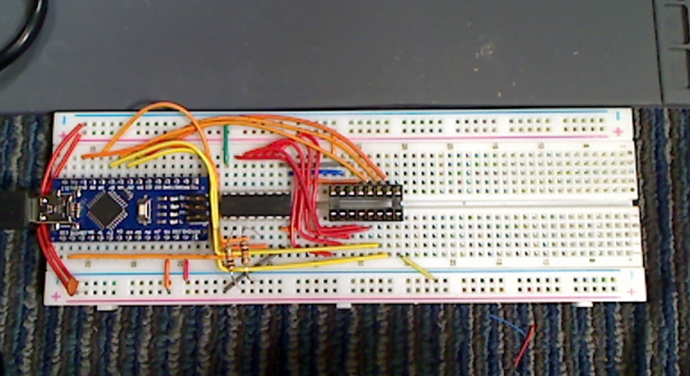

# Mac 128k RAM tester

An Arduino Nano based DRAM tester for testing the [Micron MT4264 64K](https://datasheetspdf.com/pdf-file/559895/MicronTechnology/MT4264/1) DRAM chip used in the Macintosh 128k.

**Components:**

- Arduino Nano

- 74HC595 (or other 5v SIPO shift register)

- 10k pullup resistor (2x)

- 0.1uF filtering capacitor (optional)

- DIP socket (for RAM)
  
  

Arduino sketch and KiCAD schematics are in subfolders.

Have fun making your sad Mac happy!

